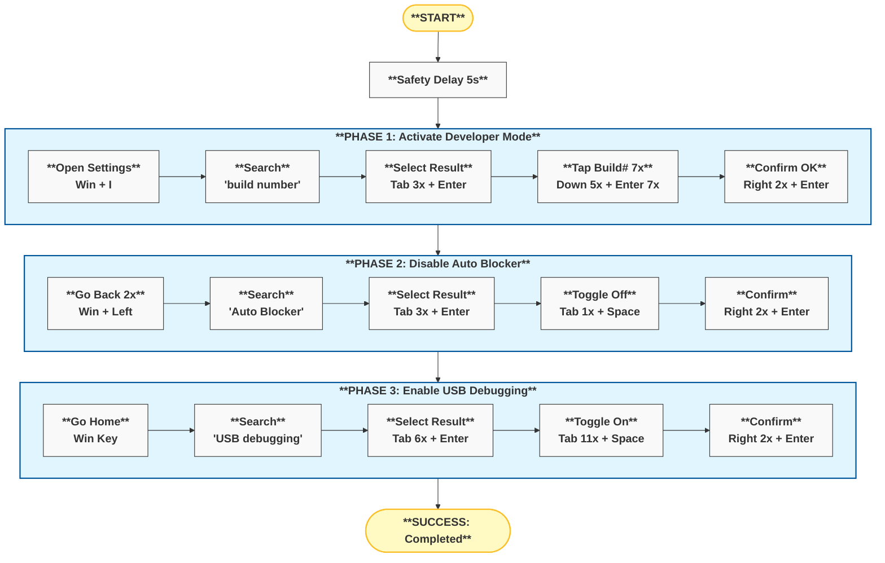

# 📉 Automation Workflow (Presentation Ready)

This flowchart is optimized for high-visibility presentations with bold text and increased font sizes.

```mermaid
graph TD
    %% Global Style Definitions
    classDef default fill:#f9f9f9,stroke:#333,stroke-width:1px,font-weight:bold,font-size:18px;
    classDef highlight fill:#e1f5fe,stroke:#01579b,stroke-width:2px,font-weight:bold,font-size:18px;
    classDef terminal fill:#fff9c4,stroke:#fbc02d,stroke-width:2px,font-weight:bold,font-size:18px;

    Start([**START**]) --> Delay[**Safety Delay 5s**]
    Delay --> Phase1

    subgraph Phase1 [**PHASE 1: Activate Developer Mode**]
        direction LR
        P1_1[**Open Settings**<br/>Win + I] --> P1_2[**Search**<br/>'build number']
        P1_2 --> P1_3[**Select Result**<br/>Tab 3x + Enter]
        P1_3 --> P1_4[**Tap Build# 7x**<br/>Down 5x + Enter 7x]
        P1_4 --> P1_5[**Confirm OK**<br/>Right 2x + Enter]
    end

    Phase1 --> Phase2

    subgraph Phase2 [**PHASE 2: Disable Auto Blocker**]
        direction LR
        P2_1[**Go Back 2x**<br/>Win + Left] --> P2_2[**Search**<br/>'Auto Blocker']
        P2_2 --> P2_3[**Select Result**<br/>Tab 3x + Enter]
        P2_3 --> P2_4[**Toggle Off**<br/>Tab 1x + Space]
        P2_4 --> P2_5[**Confirm**<br/>Right 2x + Enter]
    end

    Phase2 --> Phase3

    subgraph Phase3 [**PHASE 3: Enable USB Debugging**]
        direction LR
        P3_1[**Go Home**<br/>Win Key] --> P3_2[**Search**<br/>'USB debugging']
        P3_2 --> P3_3[**Select Result**<br/>Tab 6x + Enter]
        P3_3 --> P3_4[**Toggle On**<br/>Tab 11x + Space]
        P3_4 --> P3_5[**Confirm**<br/>Right 2x + Enter]
    end

    Phase3 --> Success([**SUCCESS: Completed**])

    %% Apply Styles
    class Phase1,Phase2,Phase3 highlight;
    class Start,Success terminal;
```
